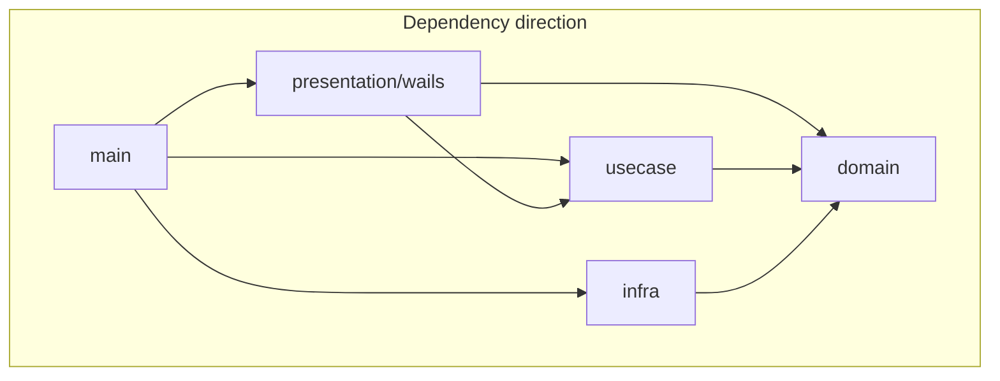
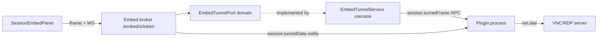

# Architecture (xQuakShell)

This document complements [CONTRIBUTING.md](../CONTRIBUTING.md) with layer rules and where to add features.

## Layer diagram

- **main** (`main.go` + `main_*.go`) wires repositories, SSH adapters (`internal/infra/ssh`), portable layout, and plugin runtime. **`app.go`** is the Wails binding facade only (see [adr/010-composition-root.md](adr/010-composition-root.md)).
- **presentation/wails** — Wails facade: `api.go`, handler files, DTOs, events. Handlers delegate to use cases; no direct infra imports.
- **presentation/logwindow** — debug log viewer subprocess and TCP stream server; depends on `domain.LogStream` only.
- **usecase** — orchestration (`SessionManager`, `TransferService`, `AuditService`, `SettingsService`, `VaultService`, `HostKeyService`, `RemoteFSService`, `LocalFSService`, plugins). Depends only on **domain** and stdlib.
- **domain** — entities and ports split across `vault_data.go`, `app_settings.go`, `repositories.go`, `host_fs.go`, `portable_data.go`, etc.
- **infra** — persistence, SSH dialer, SFTP, audit log, host FS, portable data store, plugin host, embed broker (`domain.EmbedTunnelPort`), etc.

## Filesystem zones (ADR-007)

Three trust boundaries — do not mix:

| Zone | Domain port | Infra implementation | Path policy | Key methods |
|------|-------------|------------------------|-------------|-------------|
| Host user FS | `HostFileSystem`, `HostAppLauncher` | `internal/infra/host/host_fs.go`, `launcher_*.go` | No sandbox root; trusted host UI | `List`, `Stat`, `Remove`, `Mkdir`, `Rename`, `CreateFile`, `OpenDefault`, `OpenWith` — used by `LocalFSService`, `TransferService` |
| Portable app data | `PortableDataStore` | `internal/infra/portable/data_store.go` | Jailed to `<exe>/data` | `ResolvePath`, `Remove`, `ReadFile`, `EnsureTempDir` — used by plugin install/uninstall and GitHub staging temp |
| Plugin sandbox | (IPC only) | `internal/infra/plugin/capability/fs_proxy.go` | Manifest roots + symlink checks | `fs.*` RPC only |

Run `powershell -File scripts/check-fs-boundaries.ps1` to verify zone separation.
See [adr/007-host-filesystem-trust.md](adr/007-host-filesystem-trust.md).

## Import rules (summary)

| Package | May import |
|--------|-------------|
| `internal/domain` | stdlib, `golang.org/x/crypto/ssh`, `internal/domain/*` — **not** `internal/presentation`, `internal/infra`, `internal/pkg`, `main` |
| `internal/usecase` | `internal/domain`, `internal/pkg/safego`, stdlib — **not** `internal/infra/*`, other `internal/pkg/*`, third-party |
| `internal/infra/*` | `internal/domain`, `internal/pkg`, third-party, stdlib — **not** `internal/usecase`, `internal/presentation` |
| `internal/presentation/*` | `internal/domain`, `internal/usecase`, `internal/presentation/*`, `internal/pkg/safego`, stdlib, `github.com/wailsapp/wails/v2/*`, `golang.org/x/sys/*` — **not** `internal/infra/*`, other `internal/pkg/*`, other third-party |
| `main` | all internal packages as needed for composition |

Run `powershell -File scripts/check-imports.ps1` (or `go test ./test/unit/architecture/...`) to verify layer imports. Canonical rules: [`test/unit/architecture/rules.go`](../test/unit/architecture/rules.go).

## Concurrency limiting port

| Port | Implementation | Used by | Wired in |
|------|----------------|---------|----------|
| `domain.ConcurrencyLimiter` | `internal/pkg/conlimit` | `PingManager`, `TransferService` | `main_compose.go` only |

Usecase depends on the domain interface; `conlimit.New(...)` is called only in the composition root and passed through `presentation.NewAppAPI` into usecase constructors. Do not import `internal/pkg/conlimit` from `internal/usecase` or `internal/presentation`.

## TCP ping port

| Port | Implementation | Used by | Wired in |
|------|----------------|---------|----------|
| `domain.Pinger` | `internal/infra/pinger` | `PingManager` | `main_compose.go` only |

Usecase depends on the domain interface; `pinger.NewTCPPinger(...)` is called only in the composition root and passed through `presentation.NewAppAPI` into `NewPingManager`. Do not import `internal/infra/pinger` from `internal/usecase` or `internal/presentation`. Usecase must not call `net.Dial*` directly — only `domain.Pinger`.

## Bandwidth rate limiting port

| Port | Implementation | Used by | Wired in |
|------|----------------|---------|----------|
| `domain.RateLimiter` + `domain.RateLimiterFactory` | `internal/pkg/ratelimit` | `EmbedTunnelService` | `main_plugins.go` only |

Usecase depends on the domain interfaces; `ratelimit.Factory{}` is created only in the composition root and passed into `NewEmbedTunnelService`. Do not import `internal/pkg/ratelimit` from `internal/usecase` or `internal/presentation`.

## Goroutine policy

Background goroutines in production code must use [`internal/pkg/safego`](../internal/pkg/safego) — raw `go` launches are forbidden outside tests and plugin fixtures.

- Use **`safego.GoNamed("component.action", fn)`** with dotted names (`ipc.readLoop`, `session.initPTY`, `vault.debounceFlush`).
- Panics in background goroutines are recovered and logged via `slog.Error`; they must not crash the process.
- Cleanup (`defer`, `WaitGroup.Done`, context cancellation) remains the caller's responsibility inside `fn`.

Run `make check-goroutines` (or `powershell -File scripts/check-goroutines.ps1`) to enforce this rule.

## SSH types in domain

The project uses a **thin domain** over `golang.org/x/crypto/ssh`: interfaces such as `SSHClient`, `SSHClientConfig`, and `KnownHostsRepository` use `ssh` types in signatures. New domain ports should not introduce unrelated third-party types; keep SSH as the single external crypto dependency in `domain`.

## Plugin seam (SessionConnector)

SSH sessions are handled natively in `SessionManager.connectSession`. Non-SSH protocols can be added as **plugins** by implementing `domain.SessionConnector` and registering the implementation in `main_connectors.go`.

The core ships with an **empty connector registry** (`newSessionConnectors()` returns `nil`). When a connection uses a non-SSH `protocol` value and no plugin is registered, `OpenSession` transitions to error: `protocol X not yet implemented`.

Plugin connectors receive `ConnectorHooks` to set PTY bridge, SFTP (`RemoteFS`), SSH client, and to call `OnStreamReady` for stream-based terminals.

## Where to add features

| Area | Entry points |
|------|----------------|
| **Vault / connections** | `internal/usecase/vault_service.go` (CRUD orchestration), repositories wired in `main_compose.go` only, DTOs in `dto_connection.go`, thin handlers in `handlers_vault.go`. |
| **SSH sessions** | `internal/usecase/session_manager*.go`, PTY/SFTP init via `SessionManager.InitSessionIO`, handlers in `handlers_sessions.go`. |
| **Host keys** | `internal/usecase/host_key_service.go` (parse, add/replace/remove, resolve prompt); `domain.ParseAuthorizedSSHKey`; handlers delegate in `handlers_sessions.go` and `handlers_remote_fs.go`. |
| **Remote file browser** | `internal/usecase/remote_fs_service.go` (SFTP ops, getent UID/GID cache); thin DTO handlers in `handlers_remote_fs.go`. |
| **Local file browser** | `internal/usecase/local_fs_service.go` orchestrates `HostFileSystem` + `HostAppLauncher`; infra in `internal/infra/host/`; thin handlers in `handlers_local_fs.go` (routing table in file header). |
| **Portable temp / data paths** | `domain.PortableDataStore`, `internal/infra/portable/data_store.go`. |
| **Transfers** | `domain.ConcurrencyLimiter` (`internal/pkg/conlimit`), `internal/usecase/transfer_service.go`, handlers in `handlers_transfers.go`. |
| **Settings / ping / audit** | `domain.ConcurrencyLimiter` (`internal/pkg/conlimit`), `domain.Pinger` (`internal/infra/pinger`), `settings_service.go`, `audit_service.go`, `ping_manager.go`, `handlers_settings_ping_audit.go`. |
| **Debug log window** | `domain.LogStream`, `internal/infra/loghub`, `internal/presentation/logwindow`. |
| **Plugins** | `internal/usecase/plugin_*.go`, handlers in `handlers_plugin*.go`, manifest FS checks in `infra/plugin/bundle/capabilities_validate.go`. |
| **Plugin connection fields** | Manifest: `internal/domain/plugin/fields.go`, validation in `manifest_fields_validate.go`; persistence: `PluginFieldsService`, `Connection.pluginFields`, `VaultData.pluginSecrets`; UI: `PluginConnectionFields.svelte`, `GetPluginConnectionProtocols`. |
| **Plugin protocols** | Out-of-process plugins via `PluginSessionBridge` and `session.connect` (with optional `fields`). |
| **Session embed** | `domain.RateLimiterFactory` (`internal/pkg/ratelimit`), `EmbedTunnelService`, `internal/infra/embed/broker_handler.go`, `SessionEmbedPanel.svelte`, `session.registerEmbed` / tunnel IPC. See [adr/008-session-embed-surfaces.md](adr/008-session-embed-surfaces.md). |

## SRP: plugin GitHub usecase

One type (`GitHubPluginService`), one file per reason to change — same pattern as `session_manager*.go`.

| File | Reason to change |
|------|------------------|
| `github_plugin_service.go` | Public facade: struct + constructor only (≤100 lines) |
| `github_metadata_cache.go` | Metadata cache keys and invalidation |
| `github_metadata_fetch.go` | GitHub API metadata fetch (list + by-tag) |
| `github_release_validator.go` | Release tag validation |
| `github_binary_fetch.go` | Release asset download via downloader port |
| `github_plugin_preview.go` | Install preview DTO |
| `github_plugin_install.go` | Install orchestration pipeline |
| `github_plugin_uninstall.go` | Uninstall + cache invalidation |
| `github_ports.go` | GitHub usecase ports (domain DTOs only) |

Pure platform/checksum parsing lives in `internal/domain/plugin/github_platform.go`. Security-critical flows stay isolated: list metadata must not download assets; release metadata may download checksums; install downloads verified binaries.

## SRP: plugin process host

One type (`ProcessHost`), one file per reason to change.

| File | Reason to change |
|------|------------------|
| `process_host.go` | Struct, constructor, interface assertion (≤100 lines) |
| `managed_process.go` | Managed process state + resource cleanup |
| `process_host_registry.go` | Process map, lookup, state queries |
| `process_host_lifecycle.go` | Wait, finalize, reservation rollback |
| `process_spawner.go` | Child process spawn and pipes |
| `process_sandbox.go` | Job objects, resource limits, data dir |
| `process_ipc_factory.go` | IPC server and capability proxy wiring |
| `process_initializer.go` | Plugin initialize handshake |
| `process_host_start.go` | Start pipeline orchestration |
| `process_host_stop.go` | Stop and StopAll |
| `process_host_rpc.go` | Call and Notify |

**SRP rules (enforced in CI):** new concern → new file; `internal/usecase` must not import `internal/infra`; `make check` includes `check-file-size` (300 lines for concern files, 100 for facades).

## Session embed data flow

## Tests

- Use case SSH flows: `internal/usecase/session_manager_ssh_test.go` (no network; mocked ports).
- Broader unit tests: `test/unit/`.
